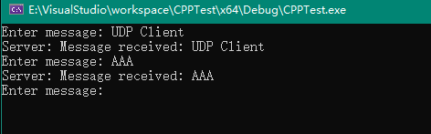

# Socket

小测试

## TCP测试

### 编译

```txt
g++ tcp_server.cpp -o tcp_server -lpthread
g++ tcp_client.cpp -o tcp_client
```

### 测试

Client（Linux）


Client（Windows）



TCP Server（Linux）


## UDP

### 编译

```txt
g++ udp_server.cpp -o udp_server
g++ udp_client.cpp -o udp_client
```

### 测试

Client（Linux）


Client（Windows）


UDP Server（Linux）

Windows客户端向Linux服务端发送中文Linux服务器端会显示乱码


# End
